
<h1 align="center">削面快餐店点餐服务系统的设计与实现</h1>

## 简介
削面快餐店点餐服务系统：角色分为管理员、用户；功能包括用户管理、订单管理、菜品展示、库存管理和餐桌预定，提升点餐效率和用户体验。    --计算机毕业设计源码；毕设源码；java毕业设计源码

## 联系方式

<h3 align="center">获取完整代码与数据库文件 + 微信：deepguan QQ: 86050149 QQ群: 783742310</h3>

<h3 align="center">可帮忙远程部署 包运行成功！提供远程部署、修改代码、设计文档指导、代码讲解等服务！</h3>

## 功能介绍（完整见运行截图）
管理员：基本功能包括登录、查看和管理用户信息、管理菜品和库存、处理订单及查询销售数据。系统提供订单管理，允许更新菜单、查看订单状态、处理订单并管理菜品库存等。管理员可以通过系统查询销售数据，查看流水列表，并按日期及支付状态进行查询及管理，以便高效处理和优化后台流程。系统还支持查看和管理餐桌预定及状态，进行用户信息更新和安全管理。

用户：用户能通过系统进行注册、登录，浏览菜单并添加菜品至购物车进行下单，查看订单状态和历史记录。用户可修改个人信息，包括用户名、密码、联系方式等，查看和管理预定的餐桌，使用简洁的导航进行高效点餐。系统支持查看菜品详细信息及高效下单，有助于用户进行快速身份验证和餐品选择，提升用户体验，确保订单准备和传递的便捷性和准确性。

## 运行截图
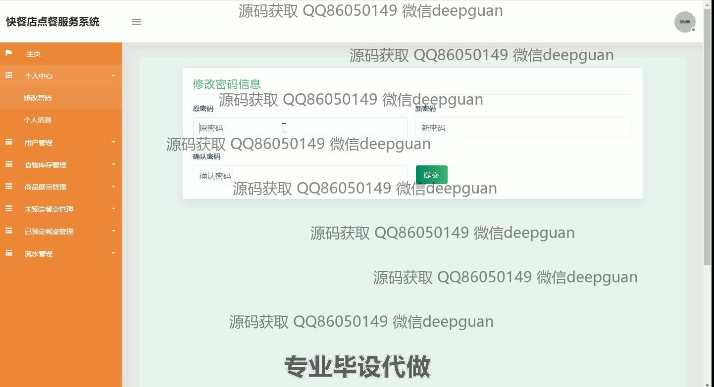
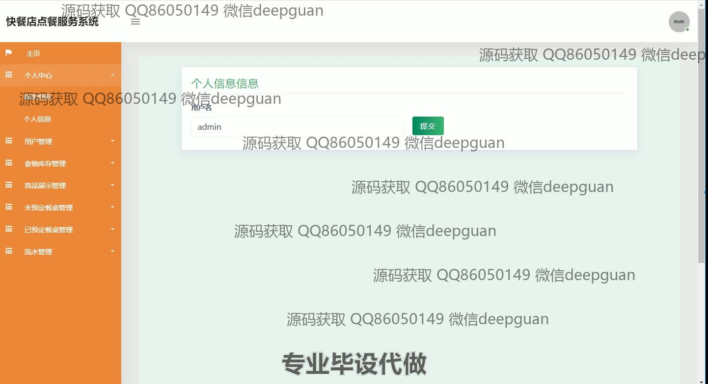
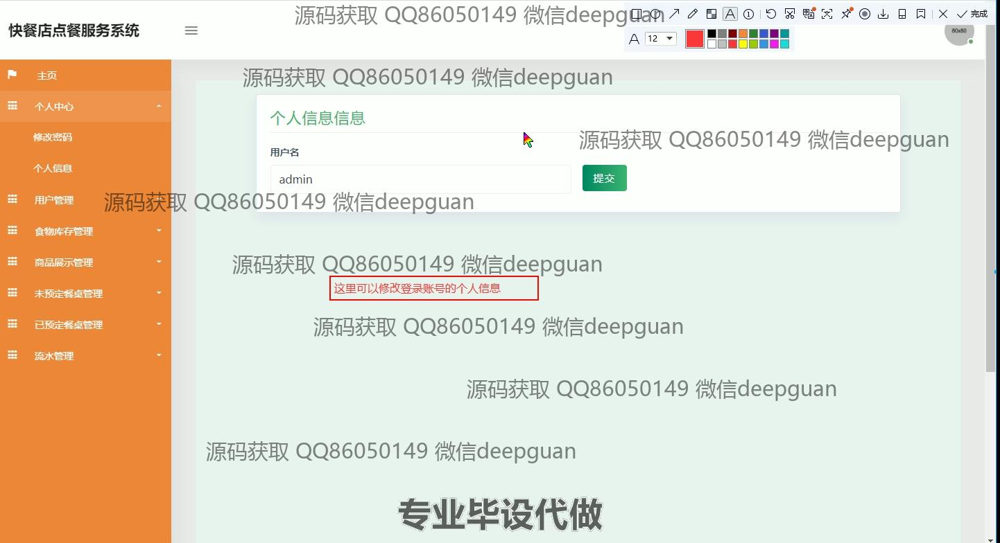

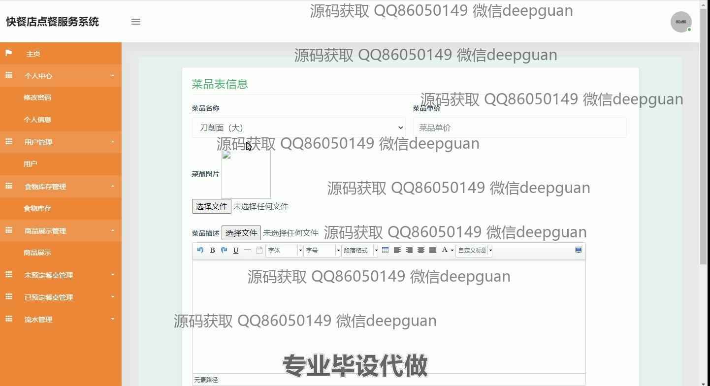
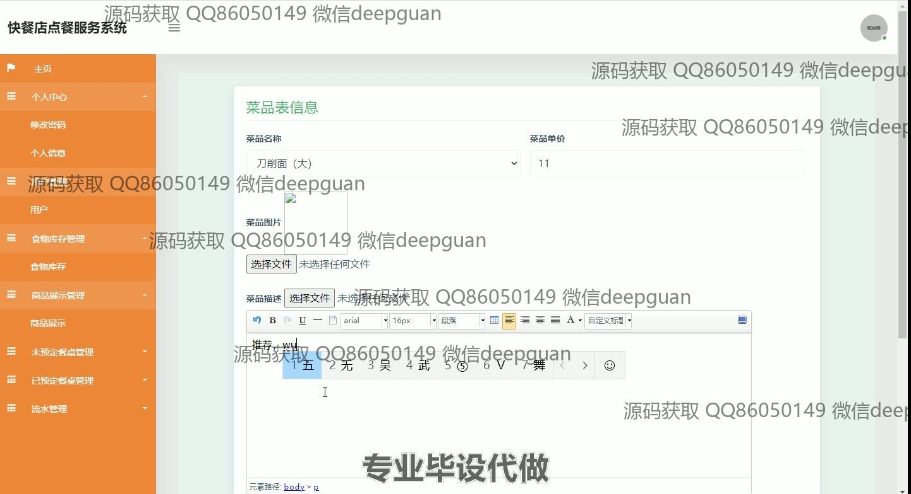
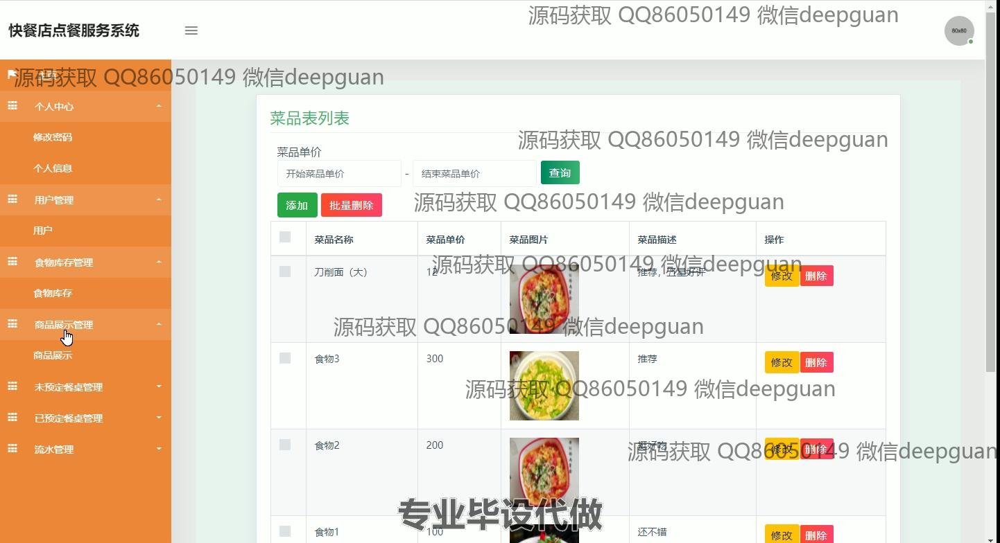
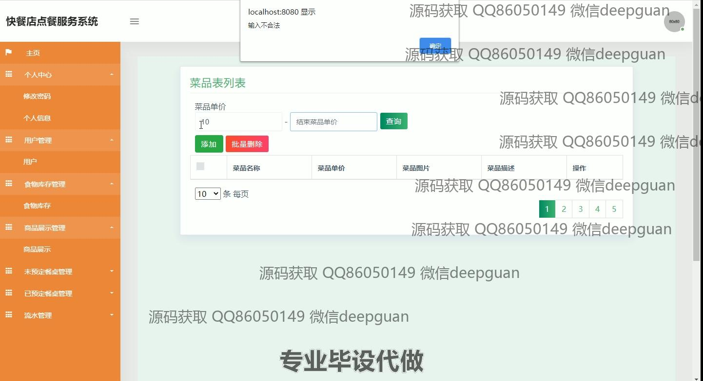
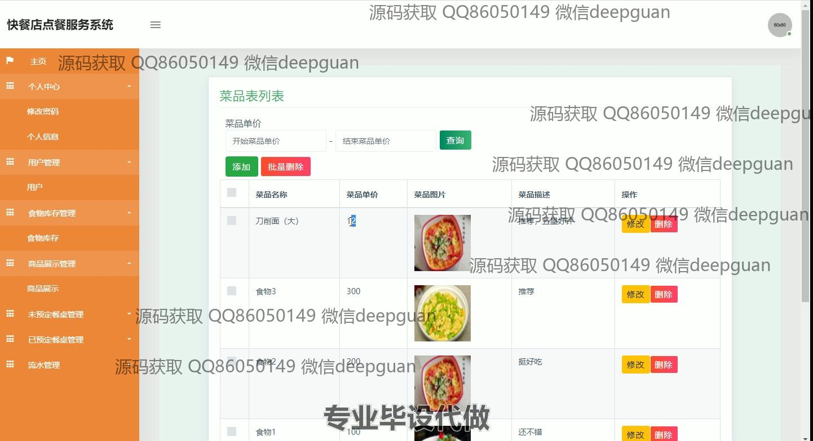
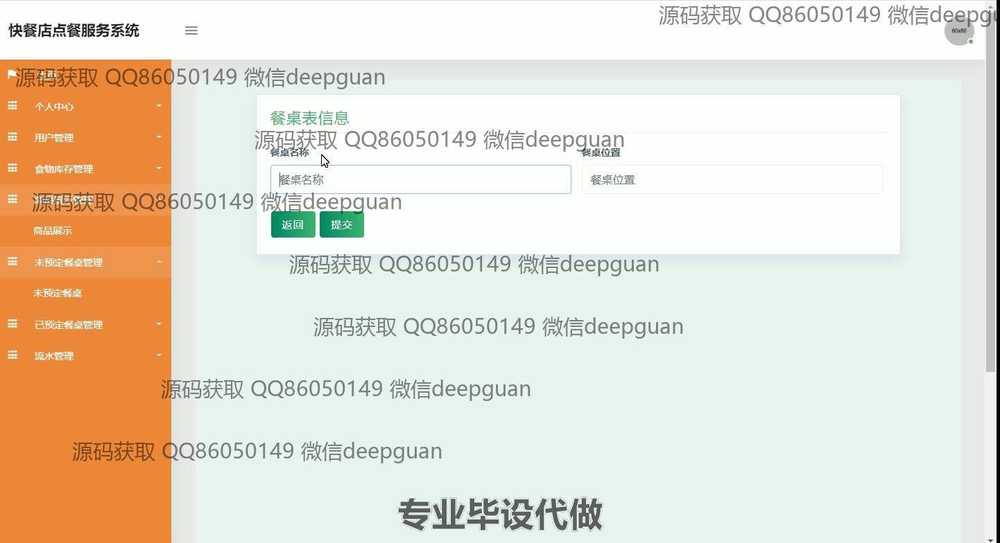
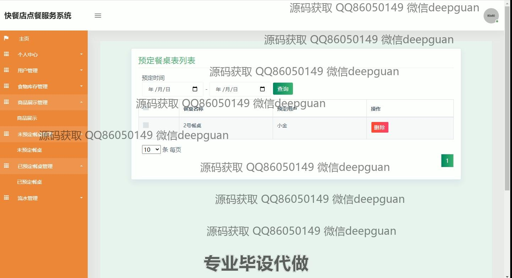
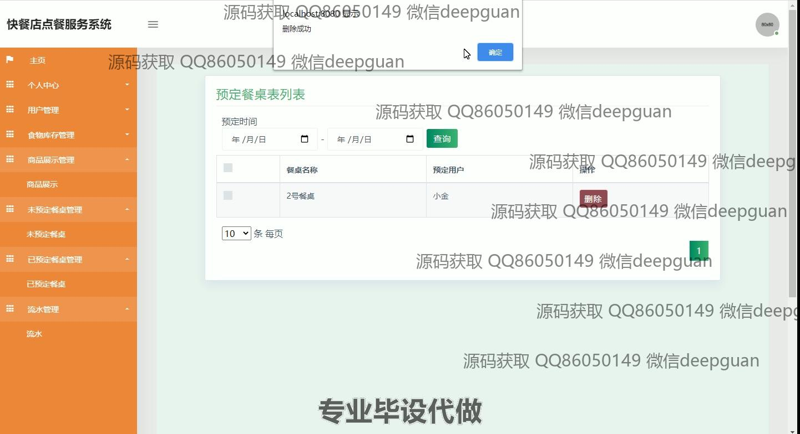
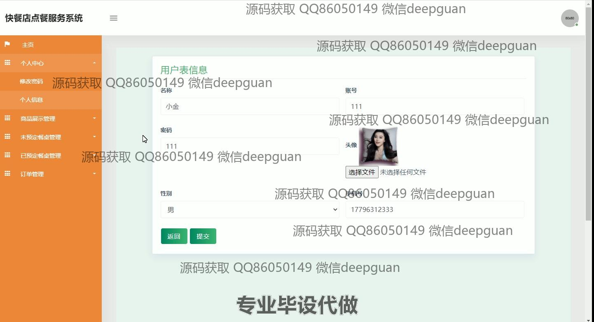
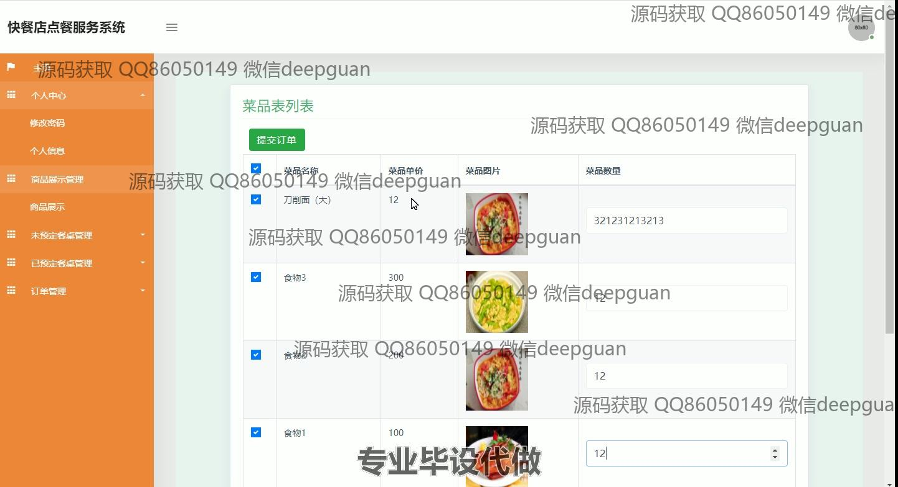
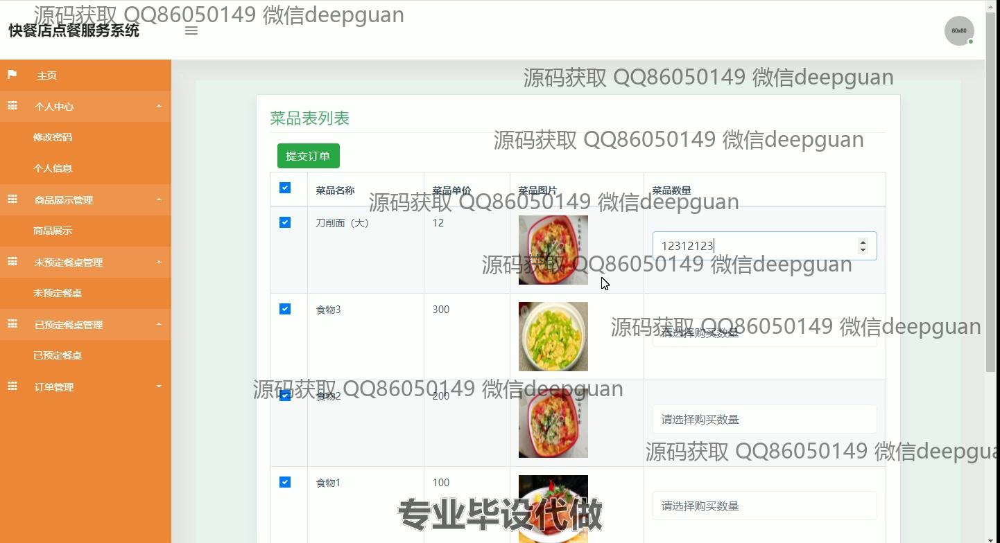
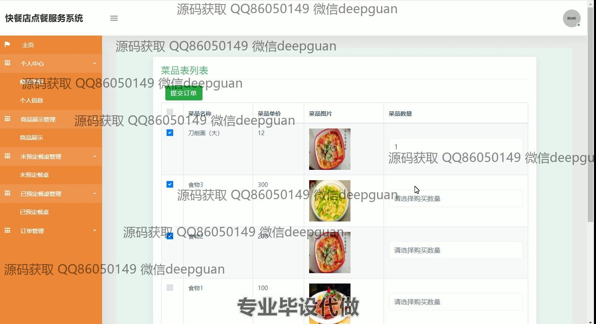
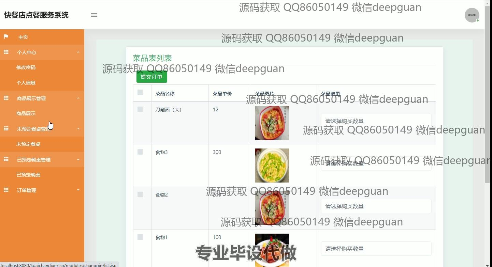
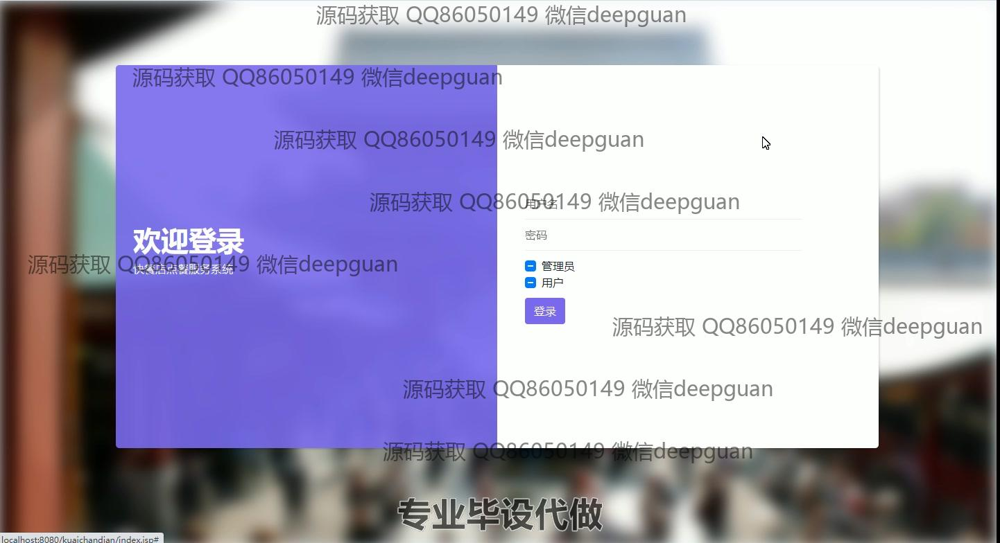
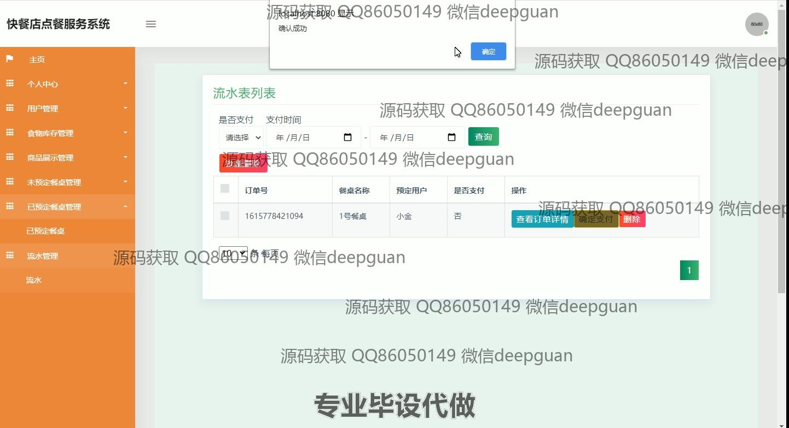

本代码来源于网络,仅供学习参考使用!

